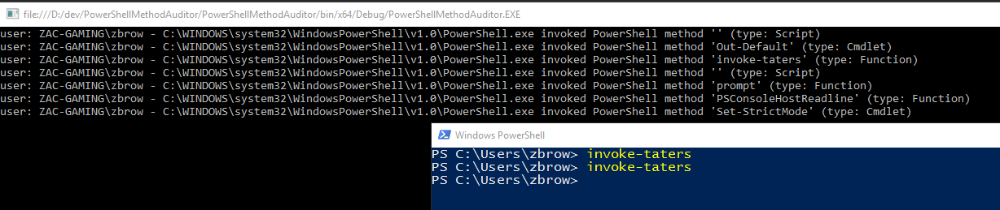

# Introduction
This is an example project for demonstrating how to use
[krabsetw](https://github.com/Microsoft/krabsetw) and its .NET bindings to consume
events from the Microsoft-Windows-PowerShell Operational log.

The Microsoft-Windows-PowerShell Operational log exposes a number of events
through the event log as well as many others which are not written to the Event
Log and only available through ETW. This example project shows how to parse EID
7937, "PowerShell Method Invocation."

After loading the project in Visual Studio 2015 and compiling it,.you should be
able to run it. You'll then need to open a powershell.exe console and run a
function (e.g. Write-Host). You should then see something similar to the
following:

# Requirements

* .NET 4.5.2 (krabsetw .NET bindings will work on 4.5 though)
* Visual Studio 2015
* Windows 7 or higher - tested on Windows 10 (64 bit required)
